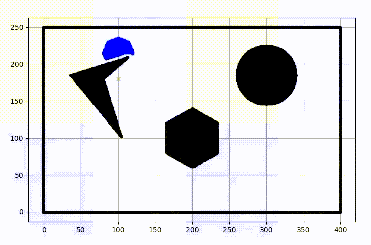
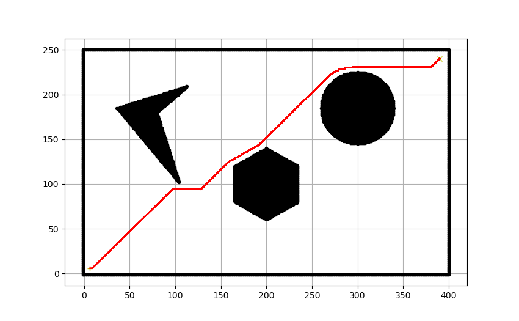

# Dijkstra
The algorithm finds the shortest path between each node in a graph for a specific source node.Alternatively, the algorithm can be used to find the shortest path from a single node to a single destination node by stoppping the process once the shortest path has been determined.

## Requirements and Libraries Used:
- cv2
- python3
- Numpy
- argparse
- matplotlib

## Steps
- Run the following commands
``` bash
git clone https://github.com/Prat33k-dev/Dijkstra-algorithm.git
cd Dijkstra-algorithm/code
python3 main.py --start 100 215 --goal 100 100 --visualize True
```
### Parameters
- start -  Start position of the robot. *Default :- [100 215]*
- goal - Goal position of the robot. *Default :- [100 100]*
- visualize - Shows visualization after goal reached. *Default :- True* 
- animate_explr - Shows visualization while exploring. *Default :- False*   

<p align="center">

</p>

### Final Backtrack Path example
<p align="center">

</p>

